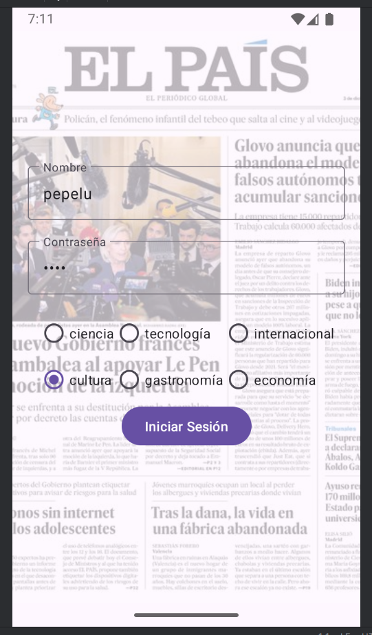

# elpaisRSS
news app loader from RSS

This is a practice for experimenting with reciclerViews and data stored in sharedPreferences.

In addition I have used a source to having real news using public rss from the newspaper "El País", sot that the use of ReciclerViews makes sense, this topic force me to experiment coroutines, to load data from internet, although it was not the object of the practice.

| LOGIN                                                                | RECYCLERVIEW                                                         |
|----------------------------------------------------------------------|----------------------------------------------------------------------|
|||
